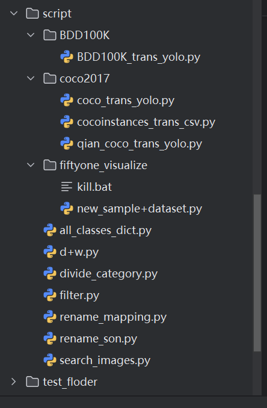

# 数据集制作总结

概括：借助脚本和roboflow网站对两个开源数据集进行标签格式的统一，过滤类别和数量，并且重命名得到一个自定义的数据集

选用coco2017数据集和BDD100K数据集 *其中coco2017数据集要选用用于目标检测的 instances_xx.json

对数据集格式统一转化为yolo格式

coco2017数据集里面的数据集格式为coco格式，我们可以利用脚本来进行数据集的转化

bdd100k数据集的目标检测部分的数据集是.json格式，同样我们利用脚本来进行数据集的转化

‍

脚本目录一览：

​

---BDD100K

```python
bdd100k_trans_yolo 用于转化bdd100k数据集为yolo数据集的格式
```

---coco2017

```python
coco_trans_yolo和qian_coco_trans_yolo 都可以用于转化coco数据集的格式为yolo
区别在于qian_trans_yolo得出来的bounding_box的数值小数点后的数字比较少，在.txt上观看更美观点
*但其实两个脚本文件得出来的数值大差不差

cocoinstances_trans_csv 用于 把coco数据集转化为.csv格式，可以在excel表格里查看
但其实这个方法很不好，数据太多了加载特别慢
```

---fiftyone_visualize

```python
引用fiftyone主要是为了验证当前转化的标签和过滤标签要求是否符合我们的需求
在部署的过程中有点困难，最后跑出来的结果也很奇怪（bounding_box偏移严重害我以为我标签转化错了）不太推荐用这种方式！
其中在运行new_sample+dataset之前要运行一下kill.bat脚本
本来想通过本地的MongoDB连接上fiftyone的但是没成功，总而言之不推荐用这种方式，如果只是验证数据集的话推荐直接用roboflow

roboflow是一个非常方便的在线查看 数据集标签可视化网站 链接：
[Workspace Home] (https://app.roboflow.com/qianshangchuan)
```

‍

在转化了数据集格式后（顺序为执行顺序）：

-> ==search_images== 用于匹配数据集中的image和label，确保他们是一对一的关系，防止之后的脚本出错，输出为一个标签和图片都可以对得上的两个文件目录

-> ==filter== 用于过滤掉指定的mapping里面的类别，通过遍历labels来删除掉不要的类别的标签，如果检测到删除了标签后当前的.txt文件里面为空，则删除掉这个label对应的image

-> ==divide_category== 用于在数据集洗牌后统计出我们需要的标签数，保证每个类别的标签数不少于我们输入的数字，输出为对应的每个类别的标签数和选中的images和labels的输出目录，其中可以通过修改随机种子来确定是否要洗牌

-> ==rename_mapping== 用于给输入目录下的文件进行从0000001开始的命名，并建立新的mapping的映射（旧mapping可能是1，4，7，9...）（新mapping要从0开始建立0，1，2，3...）

-> ==rename_son== 用于除了作为从0000001开始命名的数据集目录，输入指定开始的数字，并按照0000001的数据格式开始对目录下的数据集进行命名

-> ==d+w== 用于先进行数据集的洗牌后分配train,test,val数据集比例的脚本，输出为和classes.txt同路径下的分配好的train,val,test文件

‍

**==all_classes== 里面存着以上脚本可能要用上的一些mapping列表可以进行粘贴复制

‍

在当前制作的盲人出行项目里面

使用了coco2017和BDDK100的目标检测部分的数据集，自制了一个混合的4461张图片和label（其中每个类别保证有200个标签（除了各部分数据集内不足的））的26类别的数据集，其中labels和images的命名格式为“0000001”开始递增的字符串
